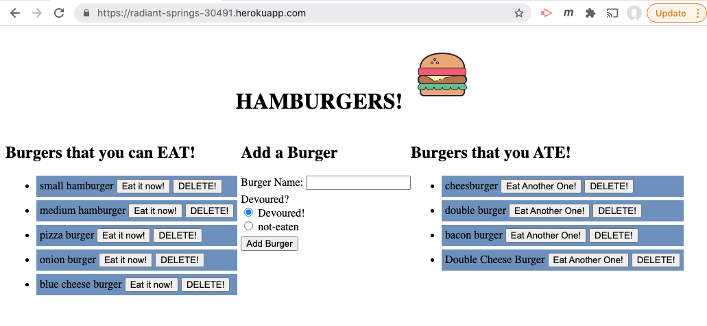
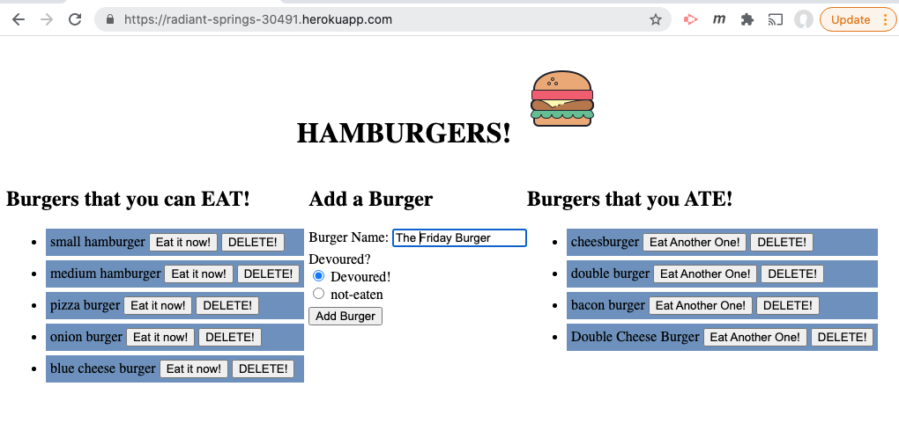
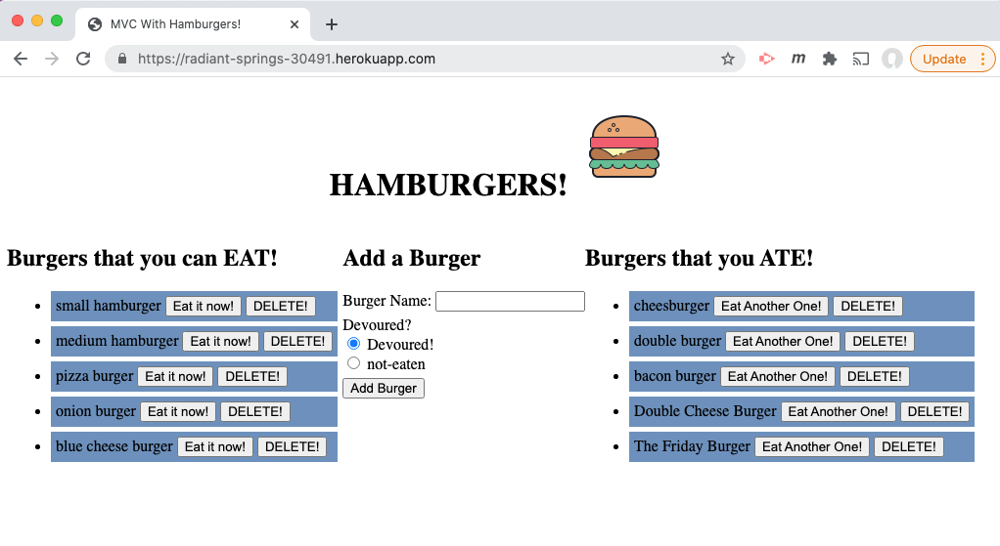
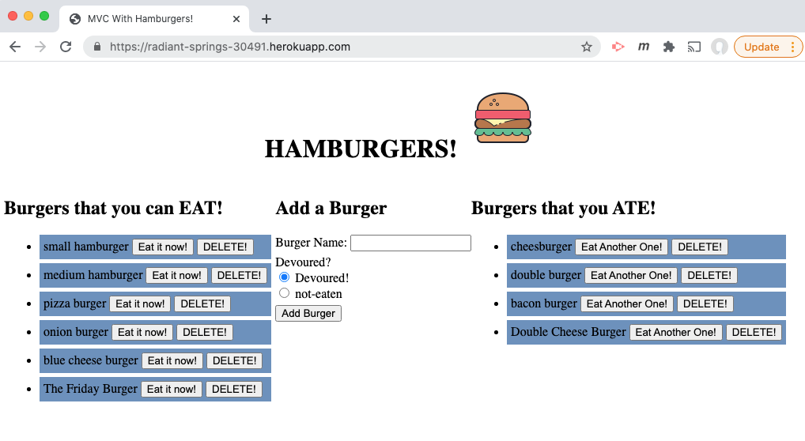

  # Project Title: HW 13 Burger App
    
  ## Table of Contents:
  - [Project Description](#project-description)
  - [Installation Instructions](#installation-instructions)
  - [Project Usage Information](#project-usage-information)
  - [Contribution Guidelines](#contribution-guidelines)
  - [Testing Instructions](#testing-instructions)
  - [License Type](#license-type)
  - [Github Repo Link](#github-repo-link)
  - [HEROKU Live APP Link](https://radiant-springs-30491.herokuapp.com/)
  - [Github Information](#github-information)
  - [my-email-for-questions-and-information](#my-email-for-questions-and-information)

  - - -
  ## Screenshot of the App running as localhost:8080 in the browser:
  
  ===
  ## Adding "The Friday Burger"
  
  ===
  ## Devouring "The Friday Burger", which places it on the right, seen in next pic
  
  ===
  ## Choosing to "Eat Another One" of "The Friday Burger", which places it now on left side, so you can eat it again.
  

  &nbsp;
  - - -
  ## Project Description:
  - This is a fun little app that tracks a user eating a Hamburger.

  &nbsp;
  - - -
  ## Installation Instructions:
  - The user only has to follow the Heroku Deployed Application link https://radiant-springs-30491.herokuapp.com/  or can run the application locally from the terminal by first running >npm i to get all dependencies and then to begin the app, type:  >node server.js  and the burger app will open in the browser.

  &nbsp;
  - - -
  ## Project Usage Information:
  - The usage of this application is to demonstrate using such technologies as: Node(server), Express(server/router framework), mySQL(database), and Handlebars(frontEnd framwork) in an MVC design pattern.  This app can be run locally and runs on Heroku - see live link in the TOC.

  &nbsp;
  - - -
  ## Contribution Guidelines:
  - I made this, PAC with Streaming Turtles, LLC

  &nbsp;
  - - -
  ## Testing Instructions:
  - Usage of the app inherently tests itself for exihibiting the MVC design pattern approach with incorporating the ORM (object relational mapping) technique as well.

  &nbsp;
  - - -
  ## License Type:
  - 

  &nbsp;
  - - -
  ## gitHub Repo Link:
  - https://github.com/streamingTurtles/13-NHE-BurgerApp

  &nbsp;
  - - -
  ## HEROKU Live Application URL:
  - https://radiant-springs-30491.herokuapp.com/

  &nbsp;
  - - -
  ## Github Information:

  
- user name: streamingTurtles
- [GitHub Profile](https://github.com/streamingTurtles)

  ## my-email-for-questions-and-information:
  - pcardillo@streamingTurtles.com  

  &nbsp;
- - -
- - -
Peter Cardillo, Columbia Engineering Fullstack Bootcamp, 2020-2021  
